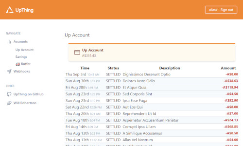
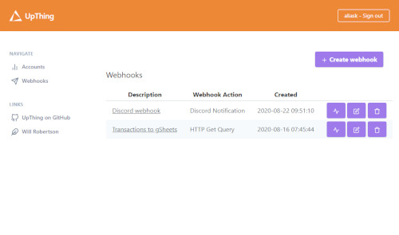

## About UpThing

UpThing uses the [Up Bank API](https://github.com/up-banking/api/) to provide a web interface for displaying account information and managing Webhooks.

### Account view



Basic account information, including transaction listing is available to view using UpThing.

### Webhook actions



The main purpose of creating UpThing was to configure webhooks for sending transaction information to various locations, including to Google Sheets and creating Discord Notifications.

## Getting Started

### Setting Up(thing)

UpThing is a Laravel-based application. Please follow [these instructions](https://laravel.com/docs/7.x/installation) to get started.

Once that's done and you can see the login screen, grab your personal access token by following the instructions on Up's website [here](https://api.up.com.au/getting_started).

Create a new account on UpThing by using the register link up in the top corner and fill in the necessary details and you should be good to go!

### Discord Integration

Create a new Discord webhook on a server you're an admin on:
1. Open the Discord Server Settings, and go to Integrations
1. Click Webhooks
1. Click New Webhook
1. Type in a name (this is what "user" the messages will come from)
1. (Optional) Give the Bot an avatar
1. Copy the Webhook URL
1. Click Save

Create a new UpThing webhook:
1. Navigate to Webhooks, Create Webhook
1. Give it a name
1. Select Discord Notification for the Action Type
1. Paste the Discord Webhook URL into the 'Action URL'
1. Click Create Webhook

Next time a transaction is settled, you should get a Discord Notification!

### Google Sheets Integration

A potentially much more useful integration is with Google Sheets, however the setup is a bit more involved.

Firstly, you will need to set up a way for Google Sheets to receive the information from UpThing. This involves creating a script within the sheet (Tools -> Script Editor), and addding the following code: 

```javascript
function getNewRow(sheet) {
  let Avals = sheet.getRange("A1:A").getValues();
  let Alast = Avals.filter(String).length;
  let newRow = Alast + 1;
  return newRow;
}

function doPost(e) {
  let jsonData = JSON.parse(e.postData.contents)
  let transaction = {
    "date": new Date(jsonData.attributes.settledAt),
    "description": jsonData.attributes.description + " (" + jsonData.attributes.rawText + ")",
    "category": jsonData.relationships.category.data.id,
    "value": jsonData.attributes.amount.value
  };
  let ss = SpreadsheetApp.getActiveSpreadsheet();
  let txSheet = ss.getSheetByName("Transactions");
  
  let newRow = getNewRow(txSheet);
  
  txSheet.getRange(newRow, 1, 1, 4).setValues([ [ 
    transaction.date,
    transaction.description,
    transaction.category,
    transaction.value
  ]]);

  let JSONOutput = ContentService.createTextOutput(`{"success":true}`);
  JSONOutput.setMimeType(ContentService.MimeType.JSON);
  return JSONOutput;
}
```
Once this has been entered, publish the script as a Web App (with anonymous access). Google have some instructions on this process [here](https://developers.google.com/apps-script/guides/web).

Create a new webhook as a JSON POST, and use the URL of the Google Script.

## License

UpThing is open-sourced software licensed under the [MIT license](https://opensource.org/licenses/MIT).
